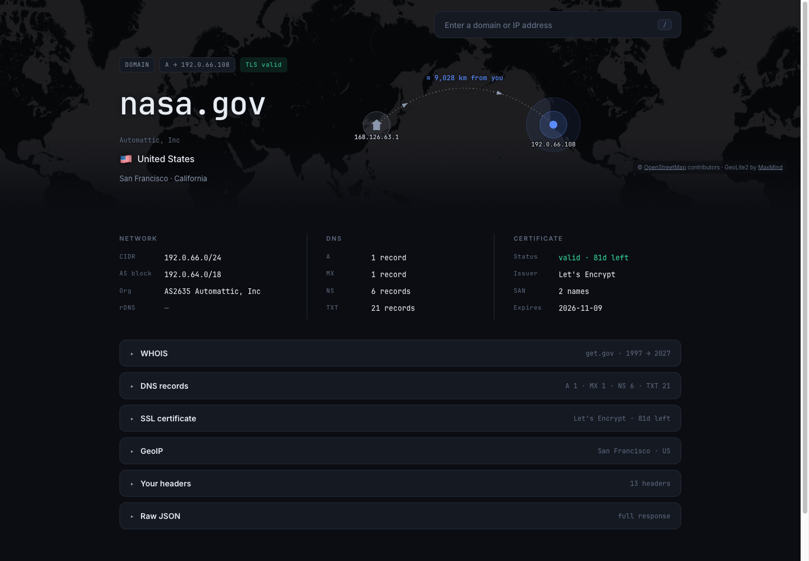
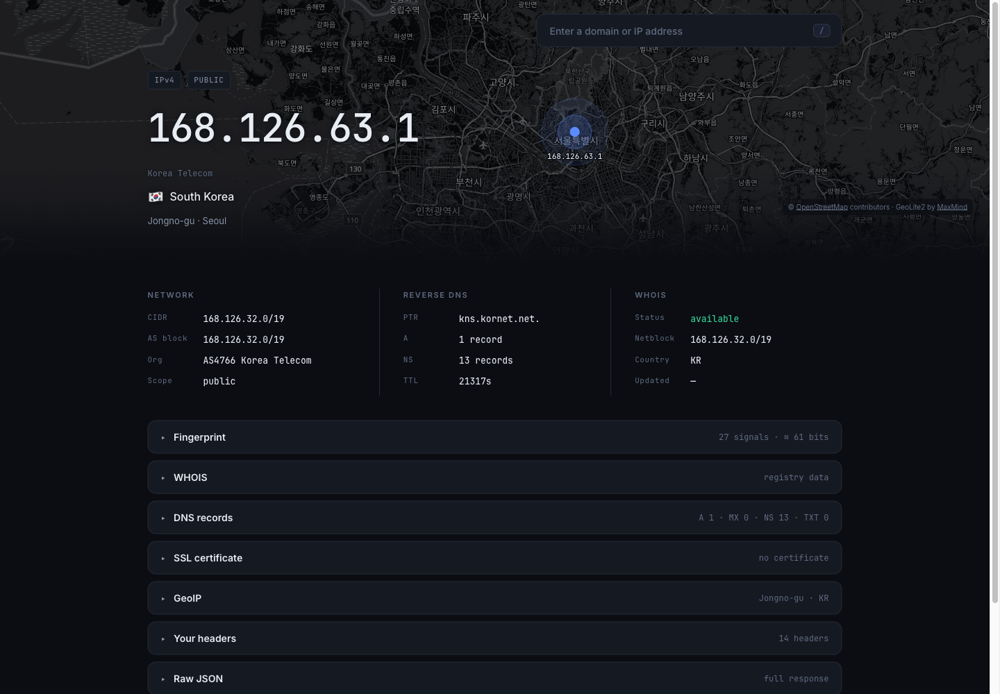
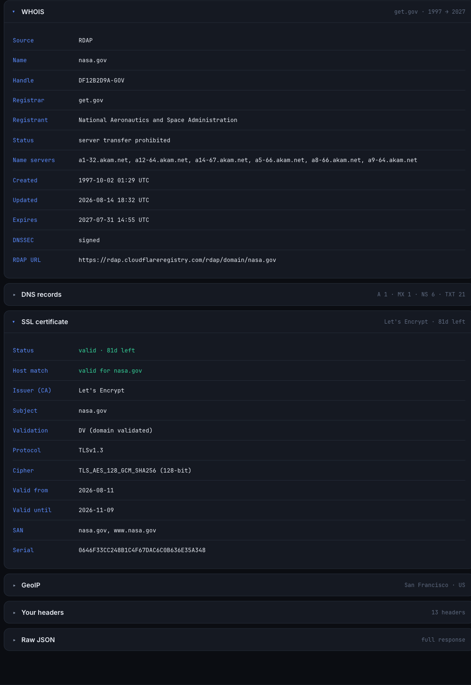
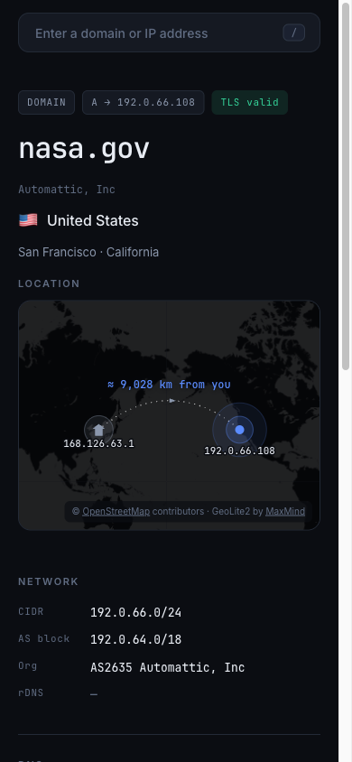

# WhatIsMyIP

[](https://github.com/1kko/whatismyip/actions/workflows/ci.yml)
[](LICENSE)


WHOIS/RDAP, GeoIP, DNS and TLS certificate details for any IP address or domain —
served as a web page to browsers, as JSON to everything else, and as an MCP
server to AI agents. One URL, three audiences, no API key.

**Live:** <https://ip.1kko.com>



```bash
# Browser -> server-rendered page (above)
open https://ip.1kko.com/nasa.gov

# Any non-browser user-agent -> JSON on the same URL
curl https://ip.1kko.com/nasa.gov

# AI agent -> MCP over Streamable HTTP
claude mcp add --transport http whatismyip https://ip.1kko.com/mcp
```

## Screenshots

### Your own address — `GET /`

Reverse DNS, netblock, carrier, and a client-side browser fingerprint panel.



### Detail panels

RDAP registration data and the full TLS certificate, expanded.



### Mobile



## Features

### Lookups

- **Registration** — RDAP first (structured JSON, sub-second), falling back to
  port-43 WHOIS for the TLDs RDAP does not serve. Both sources are normalised to
  one shape and cached for 6 hours (5 minutes for a failure).
- **GeoIP** — country and ASN from `geoip2fast`, with a GeoLite2-City overlay for
  real coordinates, the precise city and an accuracy radius, plus a GeoLite2-ASN
  overlay that keeps carrier names current. `GET /healthz` reports which
  databases are actually loaded, so a silent fallback to the bundled
  country-only database is visible from outside.
- **DNS** — A, MX, NS, CNAME, TXT, SPF and PTR, queried concurrently against
  public resolvers with a bounded per-query budget.
- **TLS** — issuer, subject, SANs, validity window, days remaining, hostname
  match, protocol and cipher.
- **Reverse DNS** for IP addresses.
- Every independent leg runs concurrently; the response reports its own
  `elapsed_ms`.

### The page

- Server-rendered (Jinja2, no client-side templating), dark theme only.
- **Map** — all projection math is server-side and unit-tested. The server emits
  tile URLs with pixel offsets and a projected great-circle polyline for two
  fixed canvases (desktop band and mobile card); the browser only paints them.
  Coordinates come from a committed GeoNames gazetteer, because `geoip2fast`
  returns city names but always leaves latitude/longitude `null`.
- **Distance** — great-circle kilometres from the visitor to the target, drawn as
  an arc. Pacific crossings wrap the antimeridian correctly instead of running
  the wrong way across Europe.
- **Fingerprint panel** (self view only) — around 27 browser signals plus an
  entropy estimate, computed in the browser and never sent to the server.
- Self-hosted fonts and a `default-src 'self'` Content-Security-Policy with a
  per-request nonce. The single allowlisted remote origin is
  `tile.openstreetmap.org` in `img-src`.

### Machine interfaces

- JSON from the same URL for any non-browser user-agent — no key, no separate
  API host.
- An MCP server at `/mcp` with four tools (see [MCP](#mcp-model-context-protocol)).
- Discovery metadata in `<head>`, so an agent that lands on the page can find the
  machine interface without scraping the body.

### Security

- **IP banning** — persistent ban list with TTL and automatic cleanup
- **Rate limiting** — sliding window (60 req/min, 10 req/sec per IP) covering
  the lookup surface, with static assets exempt and a separate, looser bucket
  for `/mcp`
- **Geographic blocking** — country/region access control, allowlist or blocklist
- **Suspicious request detection** — auto-ban on `.env`, `.php`, `/admin`,
  dotfiles and friends, unless the target is a real domain or IP
- **Request whitelisting** — protects legitimate static-file and lookup requests
- **Trusted-proxy handling** — proxy headers are honoured only from a configured
  allowlist, or from private/loopback peers when none is set (fail-closed)
- **SSRF guards** — private and reserved addresses are rejected with `400`
- **Admin API** — API-key-protected endpoints for bans and geo rules
- **Hardened responses** — HSTS, `X-Content-Type-Options: nosniff`,
  `X-Frame-Options: DENY`, `Referrer-Policy: no-referrer`, `Permissions-Policy`,
  COOP, a nonce-based CSP with `frame-ancestors 'none'`, and a suppressed
  `Server` header

> See [SECURITY.md](SECURITY.md) for the full security documentation,
> configuration reference and API usage.

## Requirements

- Python 3.12+
- Poetry (dependency management)
- Docker (optional, for containerised deployment)

### Key dependencies

| Package | Role |
| --- | --- |
| `fastapi[all]` + `uvicorn` | web framework and ASGI server |
| `whoisit` | RDAP lookups (the primary registration source) |
| `python-whois` | port-43 WHOIS fallback |
| `geoip2fast` + `maxminddb` | GeoIP country/ASN, plus the GeoLite2 overlays |
| `dnspython` | DNS resolution and record queries |
| `apscheduler` | background GeoIP / suffix-list refresh and cleanup jobs |
| `mcp` | official MCP SDK (Streamable HTTP transport) |
| `tld` | domain validation against the Public Suffix List |
| `python-dotenv` | environment configuration |
| `opentelemetry-*` | optional OTLP traces, metrics and logs |

See `pyproject.toml` for the complete list.

## Installation

### 1. Clone the repository

```bash
git clone https://github.com/1kko/whatismyip.git
cd whatismyip
```

### 2. Configure

```bash
# Copy the environment template
cp .env.example .env

# Generate a secure admin API key
python -c "import secrets; print(secrets.token_urlsafe(32))"

# Edit .env and paste the generated key
nano .env  # or vim/code
```

**Important:** replace `ADMIN_API_KEY=CHANGE_ME_TO_SECURE_RANDOM_STRING` with the
key you generated. Admin endpoints answer `404` — not `401` — to a wrong key, so
they are indistinguishable from paths that do not exist.

### 3. Install dependencies

```bash
poetry install
```

### 4. Build the image (optional)

```bash
make
```

### Regenerating vendored assets

Both are committed, so this is only needed when refreshing them:

```bash
poetry run python scripts/build_gazetteer.py   # static/geo/*.json from GeoNames
./scripts/fetch_fonts.sh                       # static/fonts/*.woff2
```

The Content-Security-Policy is `default-src 'self'`, so fonts must be
self-hosted. Map tiles come from the single allowlisted host
`tile.openstreetmap.org`: the browser fetches them directly (no API key, no
proxy), which means visitor IPs reach OSM — the footer says so, and
`© OpenStreetMap contributors` attribution is required.

Coordinates for the map do **not** come from the GeoIP database (`geoip2fast`
returns city names but never latitude/longitude). They come from the GeoNames
gazetteer above.

## Running

### Docker (preferred)

```bash
make serve   # detached, --restart unless-stopped
make run     # foreground
make logs    # follow logs
make stop    # stop the container
```

`data/` is mounted into the container, so the GeoIP databases, ban list and geo
rules survive a rebuild.

### Directly

```bash
uvicorn main:app --host 0.0.0.0 --port 8000
# or, with auto-reload
uvicorn main:app --host 0.0.0.0 --port 8000 --reload
```

## Configuration

Everything is environment-driven and collected in `config.py`, which is the
authoritative list; `.env.example` is a commented starting point covering the
common settings. The ones you are most likely to touch:

```bash
# Admin API authentication (required for /admin/*)
ADMIN_API_KEY=your-secure-random-key-here

# Rate limiting
RATE_LIMIT_REQUESTS_PER_MINUTE=60    # per IP
RATE_LIMIT_REQUESTS_PER_SECOND=10    # burst protection

# Ban durations (seconds)
BAN_DURATION_RATE_LIMIT=3600         # 1 hour for rate-limit violations
BAN_DURATION_SUSPICIOUS=86400        # 24 hours for suspicious requests

# Reverse proxy: which peers may set x-real-ip / x-forwarded-for.
# Unset means "private and loopback peers only" (fail-closed).
# TRUSTED_PROXIES=10.0.0.1

# Canonical public URL, so the copyable curl example on the page says https://
# PUBLIC_BASE_URL=https://ip.1kko.com

# Geographic blocking (optional)
# GEO_MODE=disabled                  # disabled, allowlist, or blocklist
# GEO_BLOCKED_COUNTRIES=CN,RU,KP     # comma-separated ISO 3166-1 alpha-2
# GEO_ALLOWED_COUNTRIES=US,CA,GB     # for allowlist mode

# GeoLite2 City/ASN overlays. Free jsdelivr mirrors by default; set both
# MaxMind credentials to use the official licensed downloads instead, which
# fall back to the mirrors on failure.
# MAXMIND_ACCOUNT_ID=your_account_id
# MAXMIND_LICENSE_KEY=your_license_key

# Public Suffix List — how a probe is told apart from a lookup (see below)
# TLD_LIST_URL=https://publicsuffix.org/list/public_suffix_list.dat
# TLD_NAMES_DIR=./data/tld
# TLD_MAX_AGE_DAYS=14
```

Timeouts and cache TTLs (`RDAP_TIMEOUT_SECONDS`, `WHOIS_TIMEOUT_SECONDS`,
`WHOIS_CACHE_TTL`, `DNS_QUERY_TIMEOUT`, …) are tunable through the same
mechanism — see `config.py`.

## API

FastAPI's own `/docs`, `/redoc` and `/openapi.json` are disabled; the surface is
small enough to document here.

### `GET /`

Information about the caller's own IP address. HTML for a browser user-agent,
JSON for anything else.

### `GET /{domain_or_ip}`

Information about the given domain or IP. A pasted URL is normalised to its host,
so `https://example.com/path?q=1` and `example.com` behave identically. Private
and reserved addresses are rejected with `400`.

### `GET /healthz`

Liveness plus which GeoIP databases are actually serving lookups:

```json
{
  "status": "ok",
  "databases": {
    "geoip2fast": {
      "source": "volume",
      "content": "Country + City + ASN with IPv4 and IPv6",
      "build": "MAXMIND:GeoLite2-CityASN-IPv4IPv6-en-20260605"
    },
    "city_overlay": { "loaded": true, "build": "2026-07-31" },
    "asn_overlay": { "loaded": true, "build": "2026-07-26" }
  },
  "public_suffix_list": { "source": "downloaded", "age_days": 0.0, "stale": false }
}
```

`public_suffix_list.source` is `downloaded` once a refresh has landed, `bundled`
while still running on the snapshot shipped with the `tld` package, and
`missing` if the file could not be seeded at all.

### Response example

`curl https://ip.1kko.com/nasa.gov`, abridged:

```json
{
  "address": "nasa.gov",
  "datetime": "2026-08-20T02:16:04.921503+00:00",
  "domain": {
    "a": [{ "ip": "192.0.66.108", "ttl": 454 }],
    "mx": [{ "preference": 0, "hostname": "nasa-gov.mail.protection.outlook.com.", "ttl": 600, "ip": "52.101.8.50" }],
    "ns": [{ "hostname": "a12-64.akam.net.", "ttl": 600, "ip": "184.26.160.64" }],
    "cname": null,
    "txt": [{ "text": ["MS=ms93625004"], "ttl": 364 }],
    "spf": [],
    "ptr": []
  },
  "location": {
    "ip": "192.0.66.108",
    "country_code": "US",
    "country_name": "United States",
    "city_name": "San Francisco",
    "subdivision_name": "California",
    "subdivision_code": "CA",
    "lat": 37.7794,
    "lon": -122.4176,
    "accuracy_km": 20,
    "time_zone": "America/Los_Angeles",
    "cidr": "192.0.66.0/24",
    "asn_name": "Automattic, Inc",
    "asn_cidr": "192.0.64.0/18",
    "asn_number": 2635,
    "is_private": false,
    "hostname": "",
    "precision": "city"
  },
  "whois": {
    "source": "rdap",
    "name": "nasa.gov",
    "handle": "DF12B2D9A-GOV",
    "registrar": "get.gov",
    "registrant": "National Aeronautics and Space Administration",
    "abuse_email": null,
    "status": ["server transfer prohibited"],
    "name_servers": ["a1-32.akam.net", "a12-64.akam.net"],
    "created": "1997-10-02T01:29:26+00:00",
    "updated": "2026-08-14T18:32:23.480000+00:00",
    "expires": "2027-07-31T14:55:32.905000+00:00",
    "dnssec": true,
    "whois_server": "",
    "url": "https://rdap.cloudflareregistry.com/rdap/domain/nasa.gov"
  },
  "ssl": {
    "subject": [[["commonName", "nasa.gov"]]],
    "issuer": [[["countryName", "US"]], [["organizationName", "Let's Encrypt"]], [["commonName", "YE2"]]],
    "version": 3,
    "serialNumber": "0646F33CC248B1C4F67DAC6C0B636E35A348",
    "notBefore": "Aug 11 23:22:59 2026 GMT",
    "notAfter": "Nov  9 23:22:58 2026 GMT",
    "subjectAltName": [["DNS", "nasa.gov"], ["DNS", "www.nasa.gov"]],
    "protocol": "TLSv1.3",
    "cipher": { "name": "TLS_AES_128_GCM_SHA256", "protocol": "TLSv1.3", "bits": 128 }
  },
  "headers": { "user-agent": "curl/8.7.1", "accept": "*/*" },
  "map": { "desktop": { "...": "tiles, pin and polyline in canvas pixels" }, "mobile": { "...": "" } },
  "distance_km": 9027.9,
  "origin": { "ip": "203.0.113.7", "country_code": "KR", "country_name": "South Korea", "city_name": "Jongno-gu", "lat": 37.5794, "lon": 126.9754, "accuracy_km": 20 },
  "elapsed_ms": 237
}
```

`whois.source` is `rdap` or `whois` depending on which source answered, and a
failed lookup returns `{"error": "..."}` there rather than failing the request.
`ssl` is `null` for IP lookups and for hosts that do not complete a TLS
handshake. `map` is `null` when the target has no resolvable coordinates, and
`distance_km`/`origin` are `null` whenever there is no route to draw — including
`GET /`, where the visitor *is* the target.

### Response codes

| Code | Meaning |
| --- | --- |
| `200` | success |
| `400` | private or reserved address |
| `403` | banned IP, geo-blocked, or suspicious request |
| `404` | unknown endpoint — also the answer to a wrong admin API key |
| `413` | `POST /mcp` body over `MCP_MAX_BODY_BYTES` |
| `421` | `Host` header not in `MCP_ALLOWED_HOSTS` |
| `429` | rate limit exceeded |

Every `403` answers with the same body, whichever rule fired:

```json
{"error": "Access denied due to the policy"}
```

Which rule it was — a ban, the country filter, a probe pattern — only helps
whoever is probing for the edge of it. The reason, the country and the matched
path all stay in the log line. See [Getting unbanned](#getting-unbanned).

## MCP (Model Context Protocol)

The service is also an MCP server, so AI agents can run these lookups directly.
No install, no API key:

```bash
claude mcp add --transport http whatismyip https://ip.1kko.com/mcp
```

Any MCP client that speaks Streamable HTTP works the same way — point it at
`https://ip.1kko.com/mcp`. (A client running in a browser and sending an
`Origin` header needs that origin in `MCP_ALLOWED_ORIGINS`, below; a request
with no `Origin` header at all — the normal case for a backend MCP client —
is unaffected.)

### Tools

| Tool | What it does |
|---|---|
| `lookup(target)` | Geolocation, ASN/carrier, registration, and a TLS summary for a domain or IP. Start here. |
| `dns_records(domain, types?)` | Full A / MX / NS / CNAME / TXT / SPF / PTR sweep. |
| `ssl_certificate(domain)` | Issuer, subject, SANs, validity window, days remaining. |
| `whoami_caller()` | The IP of whatever opened the MCP connection. |

### What `whoami_caller` actually reports

The address that opened the MCP connection — which is **not always yours**, and
the difference is easy to get wrong:

| Client | Connects from | So you get |
|---|---|---|
| Claude Code, Cursor, Claude Desktop | your own machine | your real IP |
| claude.ai, ChatGPT | the provider's servers | a datacenter IP |

Local clients run on your computer, so the connection genuinely originates with
you. Hosted clients do not, and no remote MCP server can see past them. The tool
cannot tell which case it is in, so it reports the connection's origin and says
so. **When it matters, open <https://ip.1kko.com> in a browser.**

### Discovery from the HTML

An agent that lands on a page rather than the endpoint can find the machine
interface from `<head>` without scraping the body:

```html
<link rel="service-doc" href="https://github.com/1kko/whatismyip#mcp-model-context-protocol">
<meta name="mcp-endpoint"  content="https://ip.1kko.com/mcp">
<meta name="mcp-transport" content="streamable-http">
<meta name="mcp-auth"      content="none">
<meta name="mcp-tools"     content="lookup, dns_records, ssl_certificate, whoami_caller">
<meta name="mcp-install"   content="claude mcp add --transport http whatismyip https://ip.1kko.com/mcp">
<meta name="mcp-note"      content="whoami_caller returns whoever opened the connection…">
<meta name="api-endpoint"  content="https://ip.1kko.com/{target}">
```

`service-doc` is the IANA-registered relation for human-readable service
documentation (RFC 8631). The `mcp-*` and `api-*` names are this site's own
convention — no registry covers them yet, so treat them as a hint, not a spec.

### Configuration

| Variable | Default | Meaning |
|---|---|---|
| `MCP_ENABLED` | `true` | Set to `false` to drop the endpoint entirely. |
| `MCP_ALLOWED_HOSTS` | `ip.1kko.com,ip.1kko.com:*` | Host allowlist. **A hostname missing here gets `421 Misdirected Request` on every request.** |
| `MCP_ALLOWED_ORIGINS` | *(empty)* | Origin allowlist for browser-based clients. A request with no `Origin` header is always allowed; one that has an `Origin` not listed here gets `403`. |
| `MCP_RATE_LIMIT_PER_MINUTE` | `120` | MCP's own rate bucket. Over-limit returns `429`; it never bans. |
| `MCP_RATE_LIMIT_PER_SECOND` | `5` | Burst ceiling for the same bucket. |
| `MCP_MAX_BODY_BYTES` | `262144` (256 KiB) | Max size of a `POST /mcp` body. Rejected with `413` before it's read into memory. |

`/mcp` is deliberately exempt from geo-blocking, the suspicious-path detector and
automatic bans: every user of a hosted AI client arrives from a handful of
provider egress IPs, so one ban would take all of them offline at once.

## Admin API

All admin endpoints require the `api-key` header set to `ADMIN_API_KEY`, compared
with `hmac.compare_digest`. A missing or wrong key gets `404`, not `401`, so the
endpoints are indistinguishable from paths that do not exist.

**There is no IP allowlist.** The key is the entire perimeter: `/admin/*` is
reachable from any address, and the only IP-based checks applied to it are the
ban list and the rate limiter (exceeding it bans, with reason
`rate_limit_admin`). The `bypass_ips` field in `data/geo_rules.json` is a
geo-blocking bypass and has nothing to do with admin auth. If you want admin
restricted by source address, do it in the reverse proxy or with
`GEO_MODE=allowlist` — neither is configured by default.

### Bans

- `GET /admin/bans` — list all banned IPs
- `POST /admin/ban/{ip}?duration=3600` — ban an IP manually
- `DELETE /admin/ban/{ip}` — unban an IP

### Geographic blocking

- `GET /admin/geo/rules` — current geo-blocking configuration
- `PUT /admin/geo/rules` — update it
- `POST /admin/geo/block/country/{code}` — block a country
- `DELETE /admin/geo/block/country/{code}` — unblock a country
- `POST /admin/geo/allow/country/{code}` — add a country to the allowlist
- `DELETE /admin/geo/allow/country/{code}` — remove it
- `GET /admin/geo/lookup/{ip}` — geographic info for an IP
- `GET /admin/geo/countries` — available country codes

### Statistics

- `GET /admin/stats` — security statistics

```bash
export API_KEY="your-api-key-from-env"

# List bans
curl -H "api-key: $API_KEY" http://localhost:8000/admin/bans

# Ban / unban an IP
curl -X POST   -H "api-key: $API_KEY" http://localhost:8000/admin/ban/192.168.1.100
curl -X DELETE -H "api-key: $API_KEY" http://localhost:8000/admin/ban/192.168.1.100

# Block a country
curl -X POST -H "api-key: $API_KEY" \
  http://localhost:8000/admin/geo/block/country/CN

# Switch to blocklist mode
curl -X PUT -H "api-key: $API_KEY" -H "Content-Type: application/json" \
  -d '{"mode": "blocklist"}' \
  http://localhost:8000/admin/geo/rules

# Statistics, and a one-off geo lookup
curl -H "api-key: $API_KEY" http://localhost:8000/admin/stats
curl -H "api-key: $API_KEY" http://localhost:8000/admin/geo/lookup/8.8.8.8
```

> See [SECURITY.md](SECURITY.md) for the complete API documentation and examples.

## Security

### Protection layers

Requests pass through the middleware in this order:

1. **IP ban check** — banned IPs are rejected immediately (`403`)
2. **Geographic filtering** — country/region access control (`403`)
3. **Suspicious pattern detection** — auto-ban on malicious paths (`403` + 24h
   ban). Static assets are exempt outright; a lookup path is exempt only when
   its target has a public suffix, so `/nasa.gov` is answered and `/admin.php`
   is banned.
4. **Rate limiting** — 60 req/min and 10 req/sec per IP (`429` + 1h ban). Static
   assets under `/static/` are exempt: one page load pulls the stylesheet, three
   scripts, four fonts, three icons and the manifest, which would trip the
   per-second limit and ban a first-time visitor. Everything else is limited,
   including `/` and `/{domain_or_ip}` — that is where the DNS, RDAP/WHOIS and
   TLS work happens.

Two surfaces are handled before this chain: `/admin/*` checks bans and rate
limits but skips geo and suspicious-path filtering, and `/mcp` checks bans and
body size and applies its own rate bucket, never escalating to a ban.

### Automatic banning

- **Rate limit exceeded** — 60 req/min or 10 req/sec → 1 hour ban
- **Suspicious request** — `.env`, `.php`, `/admin`, dotfiles, … → 24 hour ban

### Getting unbanned

There is no self-service route, and the `403` body deliberately says nothing
about how to appeal. Three ways out:

1. **Wait.** Bans carry a TTL — one hour for a rate-limit breach, 24 hours for a
   probe — and expire on their own. A background job sweeps expired entries
   every `CLEANUP_INTERVAL_SECONDS`.
2. **Lift it by hand**, if you run the service:
   ```bash
   curl -H "api-key: $API_KEY" https://your-host/admin/bans          # who is banned, and why
   curl -X DELETE -H "api-key: $API_KEY" https://your-host/admin/ban/203.0.113.7
   ```
3. **Redeploy.** The ban list lives in `data/`, so it survives a restart — but
   only if `data/` is a real volume. Where it is not (a Coolify deploy with no
   volume mount, for instance) every redeploy clears the list.

There is **no permanent allowlist**: unbanning removes the entry, it does not
exempt the address from being banned again. If you need one, it belongs in
`IPBanManager` — `bypass_ips` in `data/geo_rules.json` is a geo-blocking bypass
and has no effect on bans.

### Blocked request patterns

- Environment files: `.env`
- Script files: `.php`, `.asp`, `.aspx`
- Data files: `.json`, `.xml`, `.sql`
- Backup/config files: `.bak`, `.log`, `.conf`, `.config`, `.ini`
- Admin paths: `/admin`, `/wp-*`, `/cgi-bin/`
- Hidden files: `/.*` (dotfiles), including `/.git/`

A lookup target is a single path segment, so `/admin.php` and `/nasa.gov` are
the same shape and the pattern alone cannot separate a probe from a lookup.
What separates them is whether the segment has a **public suffix**: a request
that matches a pattern is banned unless its target is a real domain or IP.

```
/.env  /admin  /admin.php  /wp-login.php  /config.json   -> 403 + 24h ban
/path/.env  /.git/config  /wp-admin/install.php          -> 403 + 24h ban
/nasa.gov  /example.dev  /example.zip  /8.8.8.8          -> 200, ordinary lookup
/static/geo/countries.json                               -> 200, static asset
```

Static assets are exempt outright — the page's own gazetteer matches the
`\.json$` rule and banning a visitor for loading it would be absurd.

### Geographic blocking modes

```bash
# Disabled (default)
GEO_MODE=disabled

# Blocklist
GEO_MODE=blocklist
GEO_BLOCKED_COUNTRIES=CN,RU,KP,IR

# Allowlist (high security)
GEO_MODE=allowlist
GEO_ALLOWED_COUNTRIES=US,CA,GB,DE,JP
GEO_BLOCK_UNKNOWN=true
```

### The public suffix list

Telling `/nasa.gov` from `/admin.php` needs an authoritative list of what a real
suffix is. That list is Mozilla's **Public Suffix List**, the same one the `tld`
package parses:

<https://publicsuffix.org/list/public_suffix_list.dat>

(IANA also publishes a flat top-level-only list at
<https://data.iana.org/TLD/tlds-alpha-by-domain.txt>. The PSL is the one used
here because it also covers multi-label suffixes like `co.uk`, which domain
validation needs anyway.)

Leaving it to the `tld` package is not enough on two counts. Its bundled
snapshot only ages with the release, so a TLD delegated after that release reads
as a probe. And on a cache miss `tld` downloads the list *synchronously inside
whichever request needs it first*, writing into its own package directory —
root-owned once the container drops to `appuser`, so the write fails and every
later lookup retries it.

So the list lives in the data volume instead:

- **seeded** at startup from the copy bundled with `tld`, stamped expired, so
  validation works offline and before any download
- **pulled once on first boot**, because that seed is expired by definition
- **re-checked daily, re-fetched when older than `TLD_MAX_AGE_DAYS`** (14), so a
  restart does not re-download and a new suffix is picked up within a fortnight
- a failed refresh is retried after `TLD_UPDATE_RETRY_SECONDS` (1 hour)
- a response without the `===BEGIN ICANN DOMAINS===` marker — a captive portal,
  a truncated download — is rejected rather than installed. A list that matches
  nothing would make *every* domain read as a probe.

`GET /healthz` reports which copy is live.

### Persistent storage

- `data/banned_ips.json` — banned IPs with expiry times
- `data/geo_rules.json` — geographic blocking configuration
- `data/geoip2fast.dat.gz`, `data/GeoLite2-City.mmdb`, `data/GeoLite2-ASN.mmdb` —
  GeoIP databases, refreshed every 3 days (a failed refresh is retried hourly)
- `data/tld/res/effective_tld_names.dat.txt` — the public suffix list above

These survive service restarts, and the directory is a Docker volume mount.

## Testing

The whole suite runs on FastAPI's `TestClient` with every external lookup
(RDAP/WHOIS, GeoIP, DNS, reverse DNS, TLS) mocked — no running service, no
network:

```bash
pytest                                              # 308 tests
pytest tests/test_rdap.py                           # one file
pytest tests/test_basic.py::TestBasic::test_get_domain_info
pytest -v
```

Coverage spans pure units (gazetteer and distance, map projection, the view
model, RDAP/WHOIS normalisation), endpoint behaviour and HTML rendering, the MCP
tools and transport, and the security subsystem (proxy-header trust, SSRF guards,
bans, rate limiting, geo-blocking).

### Code quality

```bash
poetry run ruff check .    # lint, including Bandit security rules (S)
poetry run ruff format .
```

CI runs `pytest`, `ruff check`, `ruff format --check` and `pip-audit` on every
push and pull request.

## Project layout

```
whatismyip/
├── main.py              # FastAPI app: routes, middleware, page rendering, wiring
├── config.py            # all env-driven constants (no I/O, no import cycles)
├── managers.py          # GeoIp / Domain / SSL / Header managers
├── security.py          # IP bans, rate limit, suspicious paths, geo-blocking
├── rdap.py              # RDAP-first registration lookups + WHOIS fallback
├── lookup.py            # transport-agnostic lookup pipeline (gather())
├── mcp_server.py        # public MCP server mounted at /mcp
├── models.py            # Pydantic request models
├── geo.py               # gazetteer lookup + haversine distance
├── mapgeom.py           # Web Mercator tiles, antimeridian wrap, great-circle arcs
├── viewmodel.py         # response_data -> template view (pure, no I/O)
├── scripts/             # gazetteer rebuild, font vendoring
├── templates/           # browser.html (server-rendered page)
├── static/              # css, js, self-hosted fonts, generated geo JSON
├── tests/               # 308 tests, all offline
├── data/                # persistent volume: GeoIP DBs, bans, geo rules
├── Dockerfile           # multi-stage build (poetry export + uv pip)
├── Makefile             # Docker workflow automation
└── pyproject.toml       # Poetry dependencies and tool config
```

## Logging

Console plus a rotating `service.log` (daily rotation, 7-day retention). Every
lookup is logged as `client={client_ip} lookup={target}`, and security events
carry the country:

```
2026-08-20 11:22:24,296 - main.py:571 - security_middleware - SECURITY: Banned 203.0.113.7 (CN) for suspicious request: /.env
```

```bash
tail -f service.log | grep SECURITY   # watch live security events
grep -c SECURITY service.log          # count them
```

The Docker image starts under `opentelemetry-instrument`, so setting the standard
`OTEL_*` environment variables ships traces, metrics and logs to any OTLP
collector. Running `uvicorn` directly skips that wrapper — prefix the command
with `opentelemetry-instrument` if you want the same instrumentation locally.

## Contributing

1. Fork the repository.
2. Create a branch (`git checkout -b feature-branch`).
3. Make your changes.
4. Run `pytest` and `poetry run ruff check .`.
5. Commit and push, then open a pull request.

## License

MIT License. See [LICENSE](LICENSE) for details.

---

**🔒 Security:** for detailed security documentation, configuration options and
troubleshooting, see [SECURITY.md](SECURITY.md).
