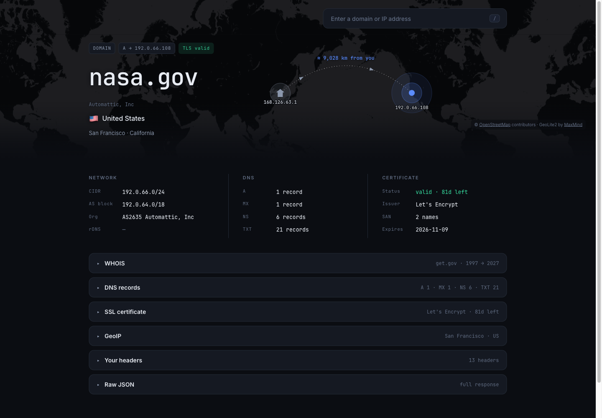
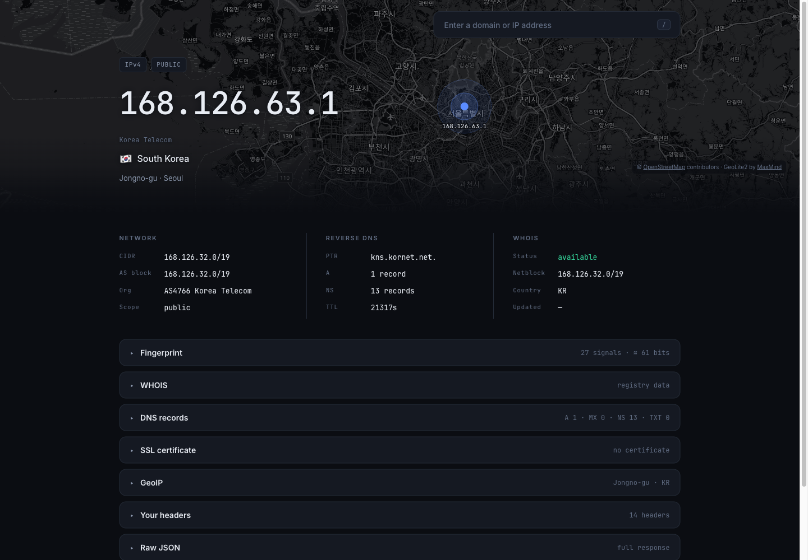
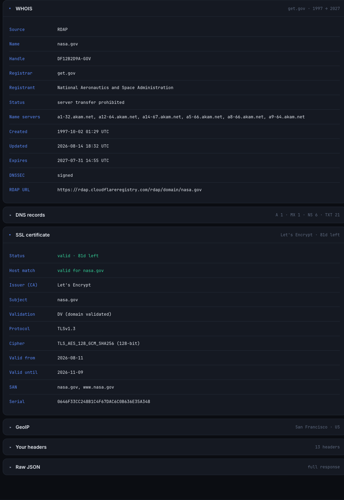
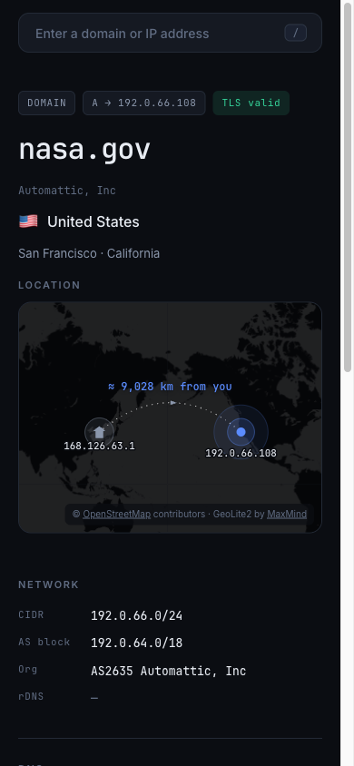

# WhatIsMyIP

[](https://github.com/1kko/whatismyip/actions/workflows/ci.yml)
[](LICENSE)


WHOIS/RDAP, GeoIP, DNS and TLS certificate details for any IP address or domain —
served as a web page to browsers, as JSON to everything else, and as an MCP
server to AI agents. One URL, three audiences, no API key.

**Live:** <https://ip.1kko.com>



```bash
# Browser -> server-rendered page (above)
open https://ip.1kko.com/nasa.gov

# Any non-browser user-agent -> JSON on the same URL
curl https://ip.1kko.com/nasa.gov

# A shell -> just your address, or just the values you name
curl 'https://ip.1kko.com?format=text'
curl 'https://ip.1kko.com/nasa.gov?fields=registrar,cert_expires&format=text'

# AI agent -> MCP over Streamable HTTP
claude mcp add --transport http whatismyip https://ip.1kko.com/mcp
```

## Screenshots

### Your own address — `GET /`

Reverse DNS, netblock, carrier, and a client-side browser fingerprint panel.



### Detail panels

RDAP registration data and the full TLS certificate, expanded.



### Mobile



## Features

### Lookups

- **Registration** — RDAP first (structured JSON, sub-second), falling back to
  port-43 WHOIS for the TLDs RDAP does not serve. Both sources are normalised to
  one shape and cached for 6 hours (5 minutes for a failure). An IP address has
  no WHOIS fallback: when its RIR's RDAP server does not answer, the lookup says
  so instead of showing the registration of the address's reverse-DNS domain.
  An RDAP server that fails three times in a row is skipped for 10 minutes.
- **GeoIP** — country, real coordinates, the precise city and an accuracy radius
  from GeoLite2-City, and the carrier from GeoLite2-ASN, both memory-mapped and
  refreshed every 3 days. Until the first download lands, the country-only
  snapshot bundled with `geoip2fast` answers country alone, so geo-blocking
  always has one to judge. `GET /healthz` reports which databases are actually
  loaded, and turns `degraded` when one is missing or its build has gone stale,
  so a silent fallback or a frozen feed is visible from outside.
- **DNS** — A, AAAA, MX, NS, CNAME, TXT, SPF and PTR, queried concurrently against
  public resolvers with a bounded per-query budget.
- **TLS** — issuer, subject, SANs, validity window, days remaining, hostname
  match, protocol and cipher, and whether the certificate is trusted. An
  expired, self-signed, wrong-host or chain-incomplete certificate is still
  shown, with the reason it fails.
- **Reverse DNS** for IP addresses.
- Every independent leg runs concurrently; the response reports its own
  `elapsed_ms`.

### The page

- Server-rendered (Jinja2, no client-side templating), dark theme only.
- **Map** — all projection math is server-side and unit-tested. The server emits
  tile URLs with pixel offsets and a projected great-circle polyline for two
  fixed canvases (desktop band and mobile card); the browser only paints them.
  Coordinates come from GeoLite2-City, with a committed GeoNames gazetteer
  (city name, then country centroid) for addresses it gives none.
- **Distance** — great-circle kilometres from the visitor to the target, drawn as
  an arc. Pacific crossings wrap the antimeridian correctly instead of running
  the wrong way across Europe.
- **Fingerprint panel** (self view only) — around 27 browser signals plus an
  entropy estimate, computed in the browser and never sent to the server.
- **WebRTC leak test** (in the fingerprint panel, opt-in) — asks one STUN server
  (`WEBRTC_STUN_URL`, Cloudflare's by default) which public address the
  browser's WebRTC traffic uses, and compares it with the address the page saw,
  per address family, so a dual-stack visitor is not reported as leaking. The
  comparison happens in the browser; nothing is sent to this server.
- Self-hosted fonts and a `default-src 'self'` Content-Security-Policy with a
  per-request nonce. The single allowlisted remote origin is
  `tile.openstreetmap.org` in `img-src`. STUN is not a fetch and no CSP
  directive covers it, so the footer and `/privacy` name the STUN server
  instead.
- **`/privacy`** — what is logged, for how long, and which third parties the
  server and the browser contact; linked from every footer.

### Machine interfaces

- JSON from the same URL for any non-browser user-agent, or for any client that
  asks with `Accept: application/json` or `?format=json` — no key, no separate
  API host (see [Response format](#response-format)).
- Plain text for a shell with `?format=text`, and `?fields=` to ask for single
  values without paying for the rest of the lookup (see
  [Plain text and `?fields=`](#plain-text-and-fields)).
- An MCP server at `/mcp` with five tools (see [MCP](#mcp-model-context-protocol)).
- Discovery metadata in `<head>`, so an agent that lands on the page can find the
  machine interface without scraping the body.

### Security

- **IP banning** — persistent ban list with TTL and automatic cleanup
- **Per-IP rules** — a hand-edited JSON allow/block list with names and
  descriptions, re-read without a restart
- **Rate limiting** — sliding window (60 req/min, 10 req/sec per IP) covering
  the lookup surface, with static assets exempt and a separate, looser bucket
  for `/mcp`
- **Geographic blocking** — country/region access control, allowlist or blocklist
- **Suspicious request detection** — auto-ban on `.env`, `.php`, `/admin`,
  dotfiles and friends, unless the target is a real domain or IP
- **Request whitelisting** — protects legitimate static-file and lookup requests
- **Trusted-proxy handling** — proxy headers are honoured only from a configured
  allowlist, or from private/loopback peers when none is set (fail-closed)
- **SSRF guards** — private and reserved addresses are rejected with `400`
- **Admin API** — API-key-protected endpoints for bans and geo rules
- **Hardened responses** — HSTS, `X-Content-Type-Options: nosniff`,
  `X-Frame-Options: DENY`, `Referrer-Policy: no-referrer`, `Permissions-Policy`,
  COOP, a nonce-based CSP with `frame-ancestors 'none'`, and a suppressed
  `Server` header

> See [SECURITY.md](SECURITY.md) for the full security documentation,
> configuration reference and API usage.

## Requirements

- Python 3.12+
- Poetry (dependency management)
- Docker (optional, for containerised deployment)

### Key dependencies

| Package | Role |
| --- | --- |
| `fastapi[all]` + `uvicorn` | web framework and ASGI server |
| `whoisit` | RDAP lookups (the primary registration source) |
| `python-whois` | port-43 WHOIS fallback |
| `maxminddb` | GeoLite2 City/ASN lookups (memory-mapped) |
| `geoip2fast` | its bundled country snapshot, the fallback before the first GeoLite2 download |
| `dnspython` | DNS resolution and record queries |
| `apscheduler` | background GeoIP / suffix-list refresh and cleanup jobs |
| `mcp` | official MCP SDK (Streamable HTTP transport) |
| `tld` | domain validation against the Public Suffix List |
| `python-dotenv` | environment configuration |
| `opentelemetry-*` | optional OTLP traces, metrics and logs |

See `pyproject.toml` for the complete list.

## Installation

### 1. Clone the repository

```bash
git clone https://github.com/1kko/whatismyip.git
cd whatismyip
```

### 2. Configure

```bash
# Copy the environment template
cp .env.example .env

# Generate a secure admin API key
python -c "import secrets; print(secrets.token_urlsafe(32))"

# Edit .env and paste the generated key
nano .env  # or vim/code
```

**Important:** replace `ADMIN_API_KEY=CHANGE_ME_TO_SECURE_RANDOM_STRING` with the
key you generated. Admin endpoints answer `404` — not `401` — to a wrong key, so
they are indistinguishable from paths that do not exist.

### 3. Install dependencies

```bash
poetry install
```

### 4. Build the image (optional)

```bash
make
```

### Regenerating vendored assets

Both are committed, so this is only needed when refreshing them:

```bash
poetry run python scripts/build_gazetteer.py   # static/geo/*.json from GeoNames
./scripts/fetch_fonts.sh                       # static/fonts/*.woff2
```

The Content-Security-Policy is `default-src 'self'`, so fonts must be
self-hosted. Map tiles come from the single allowlisted host
`tile.openstreetmap.org`: the browser fetches them directly (no API key, no
proxy), which means visitor IPs reach OSM — `/privacy` says so, and
`© OpenStreetMap contributors` attribution is required.

Coordinates for the map come from GeoLite2-City. The GeoNames gazetteer above
covers addresses it gives no coordinates for, and the window before the first
GeoLite2 download, when only a country is known.

## Running

### Docker (preferred)

```bash
make serve   # detached, --restart unless-stopped
make run     # foreground
make logs    # follow logs
make stop    # stop the container
```

`data/` is mounted into the container, so the GeoIP databases, ban list and geo
rules survive a rebuild.

### Directly

```bash
uvicorn main:app --host 0.0.0.0 --port 8000
# or, with auto-reload
uvicorn main:app --host 0.0.0.0 --port 8000 --reload
```

## Configuration

Everything is environment-driven and collected in `config.py`, which is the
authoritative list; `.env.example` is a commented starting point covering the
common settings. The ones you are most likely to touch:

```bash
# Admin API authentication (required for /admin/*)
ADMIN_API_KEY=your-secure-random-key-here

# Rate limiting
RATE_LIMIT_REQUESTS_PER_MINUTE=60    # per IP
RATE_LIMIT_REQUESTS_PER_SECOND=10    # burst protection

# Ban durations (seconds)
BAN_DURATION_RATE_LIMIT=3600         # 1 hour for rate-limit violations
BAN_DURATION_SUSPICIOUS=86400        # 24 hours for suspicious requests

# Hand-written per-IP allow/block rules (see "Per-IP rules" below)
# IP_RULES_FILE=data/ip_rules.json

# Reverse proxy: which peers may set x-real-ip / x-forwarded-for.
# Unset means "private and loopback peers only" (fail-closed).
# TRUSTED_PROXIES=10.0.0.1

# Canonical public URL, so the copyable curl example on the page, its canonical
# link and its link-preview URLs (og:url, og:image) say https:// and this host
# PUBLIC_BASE_URL=https://ip.1kko.com

# STUN server for the opt-in WebRTC leak test; empty removes the test
# WEBRTC_STUN_URL=stun:stun.cloudflare.com:3478

# Geographic blocking (optional)
# GEO_MODE=disabled                  # disabled, allowlist, or blocklist
# GEO_BLOCKED_COUNTRIES=CN,RU,KP     # comma-separated ISO 3166-1 alpha-2
# GEO_ALLOWED_COUNTRIES=US,CA,GB     # for allowlist mode

# GeoLite2 City/ASN overlays. Free jsdelivr mirrors by default; set both
# MaxMind credentials to use the official licensed downloads instead, which
# fall back to the mirrors on failure.
# MAXMIND_ACCOUNT_ID=your_account_id
# MAXMIND_LICENSE_KEY=your_license_key
# GEOIP_MAX_BUILD_AGE_DAYS=21        # /healthz reports an older build as degraded

# Public Suffix List — how a probe is told apart from a lookup (see below)
# TLD_LIST_URL=https://publicsuffix.org/list/public_suffix_list.dat
# TLD_NAMES_DIR=./data/tld
# TLD_MAX_AGE_DAYS=14
```

Timeouts and cache TTLs (`RDAP_TIMEOUT_SECONDS`, `WHOIS_TIMEOUT_SECONDS`,
`WHOIS_CACHE_TTL`, `DNS_QUERY_TIMEOUT`, …) are tunable through the same
mechanism — see `config.py`. So are the concurrency limits: `LOOKUP_CONCURRENCY`
(lookups at once, default 16), `LOOKUP_GATE_WAIT_SECONDS`,
`LOOKUP_BUSY_RETRY_AFTER_SECONDS`, `MCP_LOOKUP_CONCURRENCY`, and
`REGISTRATION_WORKERS` (threads for RDAP and port-43 WHOIS, default 8).

## API

FastAPI's own `/docs`, `/redoc` and `/openapi.json` are disabled; the surface is
small enough to document here.

### `GET /`

Information about the caller's own IP address, as HTML or JSON (see
[Response format](#response-format)). When the caller's address is private or
reserved (a development server with no proxy in front), RDAP/WHOIS and reverse
DNS are not queried; `whois` carries an `error` saying so.

### `GET /{domain_or_ip}`

Information about the given domain or IP. A pasted URL is normalised to its host,
so `https://example.com/path?q=1` and `example.com` behave identically. Private
and reserved addresses are rejected with `400`.

A target that is neither a domain name under a public suffix nor an IP address
is rejected with `400` before any lookup runs:

```json
{"error": "not a domain name or IP address", "code": "invalid_target"}
```

An IPv6 address gets the same GeoIP, registration and PTR answer an IPv4 one
does, and `address` comes back in its RFC 5952 spelling. A bracketed URL host
(`[2001:db8::1]:8443`) is accepted, and an IPv4-mapped address
(`::ffff:8.8.8.8`) is looked up as the IPv4 address it carries. 6to4
(`2002::/16`) and NAT64 (`64:ff9b::/96`) addresses are refused like private
ones. A name with no A record resolves through its AAAA record instead; this
server has no IPv6 route out, so such a name gets no TLS handshake, and `ssl`
says so (see below).

### Response format

`/` and `/{domain_or_ip}` answer HTML, JSON or plain text from the same URL. The
first of these that expresses a choice decides:

1. `?format=html`, `?format=json` or `?format=text`. Any other value is rejected
   with `400`.
2. An `Accept` header naming `text/html`, `application/json` or `text/plain`,
   with q-values honoured: a browser's `fetch()` sending
   `Accept: application/json` gets JSON, and `curl -H 'Accept: text/html'` gets
   the page.
3. The user-agent, when `Accept` is absent or only `*/*` — the default for curl,
   wget and `fetch()`. Browsers get HTML, and so do the bots that build link
   previews (Slack, KakaoTalk, X, Facebook, Telegram, WhatsApp, Discord,
   LinkedIn), since a preview is read from the page's Open Graph tags.
   Everything else gets JSON, PowerShell's `Invoke-RestMethod` included even
   though its user-agent starts with `Mozilla/5.0`.

Both routes send `Vary: Accept, User-Agent` and `Cache-Control: no-store`, so a
cache in front can neither serve one format in place of the other nor keep a
response that describes the visitor's own address.

> **Ask for a format with `?format=`, never with a suffix in the path.**
> `/nasa.gov.json` is not a lookup of nasa.gov: `.json` (like `.xml`) is one of
> the security middleware's probe patterns, and a path that matches one is
> treated as a probe unless it names a domain under a public suffix, which
> `nasa.gov.json` does not. The requesting IP is banned for 24 hours. Use
> `/nasa.gov?format=json`.

### Plain text and `?fields=`

`?format=text` (or `Accept: text/plain`) answers in plain text, for a shell.
`GET /` in text is the caller's address and a newline, and nothing else runs —
no RDAP/WHOIS, GeoIP or DNS:

```console
$ curl 'https://ip.1kko.com?format=text'
203.0.113.7
```

Quote the URL: zsh treats an unquoted `?` as a glob.

`GET /{domain_or_ip}` in text is a `key: value` block of the fields below that
apply to the target, in the table's order. It skips what it does not show: the
DNS record sweep, the map, the distance from you, and crt.sh
(`?subdomains=include` has no effect here; `?subdomains=only` still answers its
JSON list).

```console
$ curl 'https://ip.1kko.com/nasa.gov?format=text'
target: nasa.gov
ip: 192.0.66.108
country_code: US
country_name: United States
city: San Francisco
asn_number: 2635
asn_name: AUTOMATTIC
cidr: 192.0.64.0/18
registrar: get.gov
registrant: National Aeronautics and Space Administration
domain_expires: 2027-07-31
cert_issuer: Let's Encrypt
cert_expires: 2026-11-09
cert_days_remaining: 31
```

`?fields=` names the values you want, comma-separated, on either route, and runs
only the lookups those fields need: `country_code` is a domain's A query and a
read of the local GeoIP database (on `/`, just the read), and `registrar` is one
RDAP/WHOIS query that does not even resolve the domain. In text the answer is
the bare values, one per line in the order asked, even for a single field.
Otherwise it is a flat JSON object of just those fields — a browser gets JSON
too, as there is no page for a handful of values.

```console
$ curl 'https://ip.1kko.com?fields=country_code&format=text'
KR
$ curl 'https://ip.1kko.com/nasa.gov?fields=registrar,cert_days_remaining&format=text'
get.gov
31
$ curl 'https://ip.1kko.com/8.8.8.8?fields=asn_number,asn_name'
{"asn_number":15169,"asn_name":"GOOGLE"}
```

| Field | Value | Lookup it runs | Applies to |
| --- | --- | --- | --- |
| `target` | the target, after a pasted URL is cut to its host | none | both |
| `ip` | the address a domain resolves to; an IP itself; on `/`, yours | A query (domains) | both |
| `reverse_dns` | PTR name | reverse DNS | IP |
| `country_code` | ISO 3166-1 alpha-2 | GeoIP (local) | both |
| `country_name` | | GeoIP (local) | both |
| `city` | | GeoIP (local) | both |
| `asn_number` | integer in JSON | GeoIP (local) | both |
| `asn_name` | | GeoIP (local) | both |
| `cidr` | the ASN's prefix, else the GeoIP network | GeoIP (local) | both |
| `registrar` | | RDAP/WHOIS | domain |
| `registrant` | the registrant, or for an IP the network's holder | RDAP/WHOIS | both |
| `domain_expires` | registration expiry, `YYYY-MM-DD` | RDAP/WHOIS | domain |
| `cert_issuer` | the issuing CA's organisation | TLS handshake on 443 | domain |
| `cert_expires` | `YYYY-MM-DD` | TLS handshake on 443 | domain |
| `cert_days_remaining` | days left, negative once expired; integer in JSON | TLS handshake on 443 | domain |

The names are the MCP tools' own, flattened: the `lookup` tool's `tls.expires`
is `cert_expires` here, and its `registration.expires` is `domain_expires`.
Every field that touches the address resolves a domain first, so a domain that resolves to a private
address is still refused with `400`. On `/`, the fields for an IP apply to your
own address; `cert_*` and the domain-only fields are `-`.

A value is never left blank:

- `-` is an answer: there is no such value, or the field does not apply to the
  target (an IP's `registrar`, which costs no lookup). JSON has `null`.
- `?` means the lookup behind the value failed, so whether there is one is
  unknown. JSON has `null` and adds the reason under `errors`, which appears only
  then: `{"registrar": null, "errors": {"registrar": "WHOIS lookup timed out"}}`.
  For now only a failed RDAP/WHOIS lookup is told apart this way; an A query or
  TLS handshake that fails still reads `-`.

An unknown field is refused with `400` before any lookup runs:

```json
{"error": "unknown field: bogus; valid fields: target, ip, …", "code": "invalid_field"}
```

A text client gets each of the route's `400`s — `invalid_field`,
`invalid_target`, a private address, a bad `?subdomains=`
— as one line with the same status code, e.g.
`error: not a domain name or IP address`. `?format=text` and `?fields=` are
query parameters, so they pass through the same bans, geo rules and rate limit as
any other lookup.

### Subdomains (opt-in)

`GET /{domain}?subdomains=include` adds a list of the domain's subdomains, as
seen in public Certificate Transparency logs. `?subdomains=only` skips the rest
of the pipeline (DNS, TLS, GeoIP, the map) and returns just that list; it only
accepts a domain, not an IP, and answers `400` for one.

Omitting the parameter changes nothing: the default lookup never contacts
crt.sh, so its latency and uptime cannot affect an ordinary request. Any value
other than `include`/`only`/`exclude` is rejected with `400` — and so is any
value at all once `SUBDOMAIN_ENABLED=false`.

This is a **passive** lookup. It reads published certificate records and sends
nothing to the domain being queried. It finds only names that appear in a
certificate, so it is evidence of existence, never a complete inventory. Email
addresses embedded in S/MIME certificates are discarded and never returned.

Results are cached in `data/subdomains.sqlite3` and served from there; a stale
entry (older than `SUBDOMAIN_CACHE_TTL`, 7 days by default) is still returned
immediately, with a refresh kicked off in the background. Data from
[crt.sh](https://crt.sh).

### `GET /healthz`

Liveness, the deployed commit, whether anything is degraded and why, and which
GeoIP databases are actually serving lookups:

```json
{
  "status": "ok",
  "version": "08fe93c34e33922e1bdd38be3cd9528ac1342f85",
  "reasons": [],
  "databases": {
    "geoip2fast": { "source": "unused", "content": null, "build": null },
    "city_overlay": { "loaded": true, "build": "2026-07-31" },
    "asn_overlay": { "loaded": true, "build": "2026-07-26" }
  },
  "public_suffix_list": { "source": "downloaded", "age_days": 0.0, "stale": false }
}
```

`status` is `ok`, or `degraded` when `reasons` is not empty. Either way the
answer is `200`: degraded means some lookups are worse than they should be, not
that the process is down, so the container's `HEALTHCHECK` (`healthcheck.py`)
passes on any `200` and only an external monitor acts on `status`. Each reason
is a stable `code` plus a `message` naming what is wrong:

| `code` | Meaning |
|---|---|
| `geoip_bundled` | GeoLite2-City is not loaded (not downloaded yet, or the file will not open): country comes from the bundled snapshot, with no city or coordinates |
| `geoip_asn_missing` | GeoLite2-ASN is not loaded: carrier fields are empty |
| `geoip_build_stale` | a loaded GeoLite2 build is older than `GEOIP_MAX_BUILD_AGE_DAYS` (21) |
| `public_suffix_list_overdue` | the suffix list was never downloaded, or is more than two days past `TLD_MAX_AGE_DAYS` |
| `scheduler_stopped` | the background scheduler is not running, or its jobs are over 5 minutes overdue |
| `refresh_failing` | a dataset refresh (GeoLite2, suffix list) has failed twice in a row, i.e. its hourly retry failed too |
| `rdap_breaker_open` | RDAP servers currently skipped after repeated failures, so lookups routed to them fail fast |

None of these checks makes a network call, so the endpoint stays cheap to poll.

The `HEALTHCHECK` request comes from `127.0.0.1` inside the container and goes
through the security middleware like any other. Under `GEO_MODE=allowlist` a
loopback address has no country and is refused, so the container would read
as unhealthy. If you use allowlist mode, add
`{"name": "healthcheck", "ipv4": "127.0.0.1", "block": false}` to
[`data/ip_rules.json`](#per-ip-rules).

The free `geolite2-asn` mirror has not been updated since 2024-07-29, so an
instance without MaxMind credentials reports `geoip_build_stale` for
GeoLite2-ASN until `MAXMIND_ACCOUNT_ID` and `MAXMIND_LICENSE_KEY` are set or
`GEOIP_ASN_DB_URL` points at a maintained copy.

`version` is the commit SHA from the `SOURCE_COMMIT` environment variable
(Coolify sets it on every deploy; a plain `docker build` takes it as a build
arg), or `unknown` when it is unset. The deploy workflow polls it until it reads
back the commit CI passed.

Production is probed from outside by `.github/workflows/healthz-probe.yml`;
that probe and the SigNoz alerts to create by hand are described in
[`docs/ops/alerts.md`](docs/ops/alerts.md).

`databases.geoip2fast.source` is `bundled` while the country-only snapshot
shipped with `geoip2fast` is answering country — no GeoLite2-City database has
opened yet — and `unused` once one has; `content` and `build` describe that
snapshot whenever it has been loaded. `city_overlay` and `asn_overlay` are the
GeoLite2 databases themselves, under their historical names.

`public_suffix_list.source` is `downloaded` once a refresh has landed, `bundled`
while still running on the snapshot shipped with the `tld` package, and
`missing` if the file could not be seeded at all.

### `GET /robots.txt`, `GET /favicon.ico`

`/robots.txt` is plain text that keeps crawlers off `?subdomains=` links, which
can cost a crt.sh round trip each. `/favicon.ico` is a `301` to
`/static/favicon.ico`. Neither is looked up as a domain, and like `/static/`
neither counts against the rate limit.

### `GET /privacy`

An HTML page, for every client, saying what is logged and for how long, and
which third parties the server and the browser contact. Its durations,
resolvers and hosts are read from the same configuration the code runs on.
Like `/robots.txt` it is not a lookup and does not count against the rate
limit. Every page, and every answer from `/` and `/{domain_or_ip}` (JSON and
text included), carries `Link: </privacy>; rel="privacy-policy"` (RFC 6903).

### `HEAD`

`HEAD /` and `HEAD /{domain_or_ip}` answer `200` with the Content-Type a `GET`
would have (`text/plain` for text, `application/json` for `?fields=`) and no
body, without running any lookup — for uptime monitors and link checkers. A bad
`?format=` or `?fields=` is the same `400` as on `GET`. They do not tell you
whether a given target would be rejected: finding that out takes the lookup.
`/healthz`, `/robots.txt`, `/favicon.ico`, `/privacy` and `/static/` answer `HEAD` as they
answer `GET`, minus the body. `HEAD` passes through the same bans, geo rules and
rate limit as `GET`.

### Response example

`curl https://ip.1kko.com/nasa.gov`, abridged:

```json
{
  "address": "nasa.gov",
  "resolved_ip": "192.0.66.108",
  "resolution": "ok",
  "datetime": "2026-08-20T02:16:04.921503+00:00",
  "domain": {
    "a": [{ "ip": "192.0.66.108", "ttl": 454 }],
    "aaaa": [{ "ip": "2a04:fa87:fffd::c000:426c", "ttl": 102 }],
    "mx": [{ "preference": 0, "hostname": "nasa-gov.mail.protection.outlook.com.", "ttl": 600, "ip": "52.101.8.50" }],
    "ns": [{ "hostname": "a12-64.akam.net.", "ttl": 600, "ip": "184.26.160.64" }],
    "cname": null,
    "txt": [{ "text": ["MS=ms93625004"], "ttl": 364 }],
    "spf": [],
    "ptr": [],
    "status": { "a": "ok", "aaaa": "ok", "mx": "ok", "ns": "ok", "cname": "noanswer", "txt": "ok", "spf": "noanswer", "ptr": "nxdomain" }
  },
  "location": {
    "ip": "192.0.66.108",
    "country_code": "US",
    "country_name": "United States",
    "city_name": "San Francisco",
    "subdivision_name": "California",
    "subdivision_code": "CA",
    "lat": 37.7794,
    "lon": -122.4176,
    "accuracy_km": 20,
    "time_zone": "America/Los_Angeles",
    "cidr": "192.0.66.0/24",
    "asn_name": "Automattic, Inc",
    "asn_cidr": "192.0.64.0/18",
    "asn_number": 2635,
    "is_private": false,
    "hostname": "",
    "precision": "city"
  },
  "whois": {
    "source": "rdap",
    "name": "nasa.gov",
    "handle": "DF12B2D9A-GOV",
    "registrar": "get.gov",
    "registrant": "National Aeronautics and Space Administration",
    "abuse_email": null,
    "status": ["server transfer prohibited"],
    "name_servers": ["a1-32.akam.net", "a12-64.akam.net"],
    "created": "1997-10-02T01:29:26+00:00",
    "updated": "2026-08-14T18:32:23.480000+00:00",
    "expires": "2027-07-31T14:55:32.905000+00:00",
    "dnssec": true,
    "whois_server": "",
    "url": "https://rdap.cloudflareregistry.com/rdap/domain/nasa.gov"
  },
  "ssl": {
    "subject": [[["commonName", "nasa.gov"]]],
    "issuer": [[["countryName", "US"]], [["organizationName", "Let's Encrypt"]], [["commonName", "YE2"]]],
    "version": 3,
    "serialNumber": "0646F33CC248B1C4F67DAC6C0B636E35A348",
    "notBefore": "Aug 11 23:22:59 2026 GMT",
    "notAfter": "Nov  9 23:22:58 2026 GMT",
    "subjectAltName": [["DNS", "nasa.gov"], ["DNS", "www.nasa.gov"]],
    "protocol": "TLSv1.3",
    "cipher": { "name": "TLS_AES_128_GCM_SHA256", "protocol": "TLSv1.3", "bits": 128 },
    "trusted": true,
    "verify_error": null,
    "hostname_match": true
  },
  "headers": { "user-agent": "curl/8.7.1", "accept": "*/*" },
  "map": { "desktop": { "...": "tiles, pin and polyline in canvas pixels" }, "mobile": { "...": "" } },
  "distance_km": 9027.9,
  "origin": { "ip": "203.0.113.7", "country_code": "KR", "country_name": "South Korea", "city_name": "Jongno-gu", "lat": 37.5794, "lon": 126.9754, "accuracy_km": 20 },
  "elapsed_ms": 237
}
```

`domain.status` says how each record type's query ended: `ok`, `noanswer` (the
name has none of that type), `nxdomain` (the name does not exist), or a failure
— `timeout`, `servfail`, `error` — in which case the empty list next to it
means "could not find out", not "none". `resolved_ip` is the address the target
resolved to, and `resolution` is how: that A query's status for a name (`ok`
too when a name with no A record resolved through AAAA), or `literal` when the
target is an IP, so a `null` address says why.

`whois.source` is `rdap` or `whois` depending on which source answered, and a
failed lookup returns `{"error": "..."}` there rather than failing the request.
`ssl` is `null` for IP lookups and for domains with no address. A domain whose
only address is IPv6 gets `{"error": "TLS not checked", "reason": "IPv6-only
host; this server has no IPv6 connectivity"}`: no handshake was attempted, so
nothing is known about its certificate. A certificate
that fails verification still comes back in full, with `trusted: false` and
`verify_error: {"code", "message", "reason"}`: OpenSSL's verify code and message,
and a `reason` of `expired`, `not_yet_valid`, `self_signed`, `untrusted_root`,
`chain_incomplete`, `hostname_mismatch` or `other`. When no certificate could be
read at all, `ssl` is `{"error": "port 443 unreachable"}` or
`{"error": "TLS handshake failed"}`, with a `reason` such as `connection refused`
or `timed out`. `map` is `null` when the target has no resolvable coordinates, and
`distance_km`/`origin` are `null` whenever there is no route to draw — including
`GET /`, where the visitor *is* the target.

### Response codes

| Code | Meaning |
| --- | --- |
| `200` | success |
| `400` | private or reserved address, not a domain name or IP address, or an invalid `format`, `fields` or `subdomains` parameter |
| `403` | banned IP, geo-blocked, or suspicious request |
| `404` | unknown endpoint — also the answer to a wrong admin API key |
| `413` | `POST /mcp` body over `MCP_MAX_BODY_BYTES` |
| `421` | `Host` header not in `MCP_ALLOWED_HOSTS` |
| `429` | rate limit exceeded |
| `503` | too many lookups running at once (`{"error": "...", "code": "busy"}`); retry after `Retry-After` seconds. Never counts towards a ban |

Every `403` answers with the same body, whichever rule fired:

```json
{"error": "Access denied due to the policy"}
```

Which rule it was — a ban, the country filter, a probe pattern — only helps
whoever is probing for the edge of it. The reason, the country and the matched
path all stay in the log line. See [Getting unbanned](#getting-unbanned).

The bodies above are what every client that is not answered as a browser gets
(see [Response format](#response-format)). A browser gets the same status as a
small page with the search box instead: the `403` page says only the sentence
above, the `429` page adds "Try again later", and a private address such as
`192.168.0.1` gets an explanation of local network addresses and a link to `/`.
`/mcp` always answers JSON.

## MCP (Model Context Protocol)

The service is also an MCP server, so AI agents can run these lookups directly.
No install, no API key:

```bash
claude mcp add --transport http whatismyip https://ip.1kko.com/mcp
```

Any MCP client that speaks Streamable HTTP works the same way — point it at
`https://ip.1kko.com/mcp`. (A client running in a browser and sending an
`Origin` header needs that origin in `MCP_ALLOWED_ORIGINS`, below; a request
with no `Origin` header at all — the normal case for a backend MCP client —
is unaffected.)

### Tools

| Tool | What it does |
|---|---|
| `lookup(target)` | Geolocation, ASN/carrier, registration, and a TLS summary for a domain or IP. Start here. |
| `dns_records(domain, types?)` | Full A / AAAA / MX / NS / CNAME / TXT / SPF / PTR sweep. A type whose query failed comes back as `{"error": "timeout"}` (or `servfail`, `error`), never as an empty list. |
| `ssl_certificate(domain)` | Issuer, subject, SANs, validity window, days remaining, and whether the certificate is trusted (with the reason when it is not). |
| `whoami_caller()` | The IP of whatever opened the MCP connection. |
| `subdomains(domain, limit=200)` | Subdomains seen in public Certificate Transparency logs — passive, CT-only. Hidden when `SUBDOMAIN_ENABLED=false`. |

A call that could not answer at all (a private or malformed target, a timeout,
no TLS handshake, the CT source unavailable) comes back with `isError: true` and
`{"error": "..."}` as its structured content. A call that answered with a gap in
it, such as one DNS type timing out, the registration lookup failing inside
`lookup`, or a stale subdomain list, is a normal result that carries the gap.

### What `whoami_caller` actually reports

The address that opened the MCP connection — which is **not always yours**, and
the difference is easy to get wrong:

| Client | Connects from | So you get |
|---|---|---|
| Claude Code, Cursor, Claude Desktop | your own machine | your real IP |
| claude.ai, ChatGPT | the provider's servers | a datacenter IP |

Local clients run on your computer, so the connection genuinely originates with
you. Hosted clients do not, and no remote MCP server can see past them. The tool
cannot tell which case it is in, so it reports the connection's origin and says
so. **When it matters, open <https://ip.1kko.com> in a browser.**

### Discovery from the HTML

An agent that lands on a page rather than the endpoint can find the machine
interface from `<head>` without scraping the body:

```html
<link rel="service-doc" href="https://github.com/1kko/whatismyip#mcp-model-context-protocol">
<meta name="mcp-endpoint"  content="https://ip.1kko.com/mcp">
<meta name="mcp-transport" content="streamable-http">
<meta name="mcp-auth"      content="none">
<meta name="mcp-tools"     content="lookup, dns_records, ssl_certificate, subdomains, whoami_caller">
<meta name="mcp-install"   content="claude mcp add --transport http whatismyip https://ip.1kko.com/mcp">
<meta name="mcp-note"      content="whoami_caller returns whoever opened the connection…">
<meta name="api-endpoint"  content="https://ip.1kko.com/{target}">
```

`service-doc` is the IANA-registered relation for human-readable service
documentation (RFC 8631). The `mcp-*` and `api-*` names are this site's own
convention — no registry covers them yet, so treat them as a hint, not a spec.

`mcp-tools`, and the tool list in the page's Raw JSON panel, are rendered from
the tools the server registered (`registered_tool_names()` in `mcp_server.py`),
in `tools/list` order. They cannot list a tool the server does not offer:
`subdomains` drops out of both with `SUBDOMAIN_ENABLED=false`.

### MCP Registry

[`server.json`](server.json) is this server's entry in the official
[MCP Registry](https://registry.modelcontextprotocol.io): the name
`io.github.1kko/whatismyip`, one `streamable-http` remote at
`https://ip.1kko.com/mcp`, and no package. PulseMCP and Glama pick servers up
from the registry. The other directories, and what each one needs, are in
[`docs/ops/mcp-directories.md`](docs/ops/mcp-directories.md).

Publishing is manual, through `.github/workflows/mcp-publish.yml`:

1. Bump `version` in `server.json` (rules below) in the pull request that
   changes what the listing should say.
2. Merge, and wait for the Deploy workflow to finish.
3. Actions → **Publish to MCP Registry** → Run workflow, on `main`.
4. Check it is listed:
   `curl -s 'https://registry.modelcontextprotocol.io/v0/servers?search=io.github.1kko/whatismyip'`

The workflow runs on a GitHub-hosted runner, never on the self-hosted deploy
runner. It logs in with GitHub OIDC, which grants the `io.github.1kko/*`
namespace with no stored secret. It never uses the registry's HTTP login, which
makes the registry fetch `/.well-known/mcp-registry-auth` from this site: the
suspicious-path detector bans that path for 24 hours.

**Versioning.** Plain SemVer, starting at `1.0.0`. The registry refuses a
version it already has, and a published version can never be edited, only
marked deprecated, so every publish needs a new version. Bump the part a
connected client would notice:

| Bump | When |
|---|---|
| patch | listing text only: description, title, icon, website |
| minor | a tool added, or an optional argument added to one |
| major | a tool removed or renamed, an argument removed or made required, or the endpoint URL changed |

Do not add a prerelease suffix such as `1.0.0-1`. SemVer sorts it below
`1.0.0`, so the registry would not mark it as the latest version.

### Configuration

| Variable | Default | Meaning |
|---|---|---|
| `MCP_ENABLED` | `true` | Set to `false` to drop the endpoint entirely. |
| `MCP_ALLOWED_HOSTS` | `ip.1kko.com,ip.1kko.com:*` | Host allowlist. **A hostname missing here gets `421 Misdirected Request` on every request.** |
| `MCP_ALLOWED_ORIGINS` | *(empty)* | Origin allowlist for browser-based clients. A request with no `Origin` header is always allowed; one that has an `Origin` not listed here gets `403`. |
| `MCP_RATE_LIMIT_PER_MINUTE` | `120` | MCP's own rate bucket. Over-limit returns `429`; it never bans. |
| `MCP_RATE_LIMIT_PER_SECOND` | `5` | Burst ceiling for the same bucket. |
| `MCP_MAX_BODY_BYTES` | `262144` (256 KiB) | Max size of a `POST /mcp` body. Rejected with `413` before it's read into memory. |
| `MCP_LOOKUP_CONCURRENCY` | `8` | MCP's share of the lookup gate (`LOOKUP_CONCURRENCY`): tool calls never hold more than this many of its slots, so the page keeps the rest. |

`/mcp` is deliberately exempt from geo-blocking, the suspicious-path detector and
automatic bans: every user of a hosted AI client arrives from a handful of
provider egress IPs, so one ban would take all of them offline at once.

## Admin API

All admin endpoints require the `api-key` header set to `ADMIN_API_KEY`, compared
with `hmac.compare_digest`. A missing or wrong key gets `404`, not `401`, so the
endpoints are indistinguishable from paths that do not exist.

**There is no IP allowlist.** The key is the entire perimeter: `/admin/*` is
reachable from any address, and the only IP-based checks applied to it are the
ban list and the rate limiter (exceeding it bans, with reason
`rate_limit_admin`). The `bypass_ips` field in `data/geo_rules.json` is a
geo-blocking bypass and has nothing to do with admin auth. If you want admin
restricted by source address, do it in the reverse proxy or with
`GEO_MODE=allowlist` — neither is configured by default.

### Bans

- `GET /admin/bans` — list all banned IPs
- `POST /admin/ban/{ip}?duration=3600` — ban an IP manually
- `DELETE /admin/ban/{ip}` — unban an IP

### Per-IP rules

- `GET /admin/ip-rules` — the rules currently in effect (read-only; the file is
  edited by hand and re-read on change)

### Geographic blocking

- `GET /admin/geo/rules` — current geo-blocking configuration
- `PUT /admin/geo/rules` — update it
- `POST /admin/geo/block/country/{code}` — block a country
- `DELETE /admin/geo/block/country/{code}` — unblock a country
- `POST /admin/geo/allow/country/{code}` — add a country to the allowlist
- `DELETE /admin/geo/allow/country/{code}` — remove it
- `GET /admin/geo/lookup/{ip}` — geographic info for an IP
- `GET /admin/geo/countries` — available country codes

### Statistics

- `GET /admin/stats` — security statistics

```bash
export API_KEY="your-api-key-from-env"

# List bans
curl -H "api-key: $API_KEY" http://localhost:8000/admin/bans

# Ban / unban an IP
curl -X POST   -H "api-key: $API_KEY" http://localhost:8000/admin/ban/192.168.1.100
curl -X DELETE -H "api-key: $API_KEY" http://localhost:8000/admin/ban/192.168.1.100

# Block a country
curl -X POST -H "api-key: $API_KEY" \
  http://localhost:8000/admin/geo/block/country/CN

# Switch to blocklist mode
curl -X PUT -H "api-key: $API_KEY" -H "Content-Type: application/json" \
  -d '{"mode": "blocklist"}' \
  http://localhost:8000/admin/geo/rules

# Statistics, and a one-off geo lookup
curl -H "api-key: $API_KEY" http://localhost:8000/admin/stats
curl -H "api-key: $API_KEY" http://localhost:8000/admin/geo/lookup/8.8.8.8
```

> See [SECURITY.md](SECURITY.md) for the complete API documentation and examples.

## Security

### Protection layers

Requests pass through the middleware in this order:

0. **Per-IP rules** — a hand-written entry in `data/ip_rules.json` decides
   first: `block: true` refuses, `block: false` skips layers 1–3 below (see
   [Per-IP rules](#per-ip-rules))
1. **IP ban check** — banned IPs are rejected immediately (`403`)
2. **Geographic filtering** — country/region access control (`403`)
3. **Suspicious pattern detection** — auto-ban on malicious paths (`403` + 24h
   ban). Static assets are exempt outright; a lookup path is exempt only when
   its target has a public suffix, so `/nasa.gov` is answered and `/admin.php`
   is banned.
4. **Rate limiting** — 60 req/min and 10 req/sec per IP (`429` + 1h ban). Static
   assets under `/static/` are exempt: one page load pulls the stylesheet, three
   scripts, four fonts, three icons and the manifest, which would trip the
   per-second limit and ban a first-time visitor. Everything else is limited,
   including `/` and `/{domain_or_ip}` — that is where the DNS, RDAP/WHOIS and
   TLS work happens.

Two surfaces are handled before this chain: `/admin/*` checks bans and rate
limits but skips geo and suspicious-path filtering, and `/mcp` checks bans and
body size and applies its own rate bucket, never escalating to a ban.

Past the middleware, every lookup takes a slot at one gate shared by the page,
the JSON API and `/mcp`: at most `LOOKUP_CONCURRENCY` (16) run at once, and MCP
tool calls hold at most `MCP_LOOKUP_CONCURRENCY` (8) of those. A lookup that
finds no slot free within `LOOKUP_GATE_WAIT_SECONDS` (0.5) gets a `503` with
`Retry-After`, and an MCP tool call an error saying the same. A full server is
not the visitor's doing, so the `503` never bans. `/?format=text` and `HEAD`
do no lookup and take no slot.

### Automatic banning

- **Rate limit exceeded** — 60 req/min or 10 req/sec → 1 hour ban
- **Suspicious request** — `.env`, `.php`, `/admin`, dotfiles, … → 24 hour ban

### Per-IP rules

`data/ip_rules.json` is a hand-written list that sits in front of every check
above. It is the one security file meant to be read and edited by a person, so
each entry carries a name and a description:

```json
[
  {"name": "abc-menubot", "ipv4": "100.86.195.17", "block": false, "ratelimit": true,  "description": "menu bot"},
  {"name": "office",      "ipv4": "203.0.113.0/24", "block": false, "ratelimit": false, "description": "Seoul office"},
  {"name": "rogue-host",  "ipv4": "203.0.113.9",    "block": true,                      "description": "compromised box in the office range"}
]
```

| Field | Meaning |
| --- | --- |
| `ipv4` | A single address or a CIDR range. A bare address is just a `/32`. |
| `block` | `false` — trusted: never auto-banned, an existing ban is ignored, geo-blocking and the probe detector are skipped. `true` — refused outright, with no expiry. Defaults to `false`. |
| `ratelimit` | Whether a trusted address still pays the rate limit. Defaults to **`true`** — waiving the ceiling is the more dangerous choice, so it has to be asked for. A trusted address that trips the limit gets `429` and is *not* banned. |
| `name`, `description` | For whoever reads the file, and for the log line when a rule changes what would have happened. |

The most specific network wins, so the `rogue-host` `/32` above beats the
`office` `/24` regardless of the order they appear in.

The file is re-read whenever its mtime changes, so adding a bot is an edit, not
a redeploy. A malformed file keeps the rules already loaded; a malformed *entry*
is logged and skipped — a typo must not take the service down, and must not
silently widen access either. `GET /admin/ip-rules` shows what is actually in
effect.

### Getting unbanned

There is no self-service route, and the `403` body deliberately says nothing
about how to appeal. Three ways out:

1. **Wait.** Bans carry a TTL — one hour for a rate-limit breach, 24 hours for a
   probe — and expire on their own. A background job sweeps expired entries
   every `CLEANUP_INTERVAL_SECONDS`.
2. **Lift it by hand**, if you run the service:
   ```bash
   curl -H "api-key: $API_KEY" https://your-host/admin/bans          # who is banned, and why
   curl -X DELETE -H "api-key: $API_KEY" https://your-host/admin/ban/203.0.113.7
   ```
3. **Redeploy — only where `data/` is not persistent.** The ban list lives in
   `data/banned_ips.json`, so with a real volume behind it (what `make serve`
   and any sane deployment give you) bans survive restarts *and* redeploys, and
   this is not a way out. Without one, the container's `data/` goes with the
   container and every redeploy clears the list. Check before relying on it:
   `docker inspect <container> --format '{{json .Mounts}}'`.

Unbanning removes the entry but does not exempt the address from being banned
again. For that, add a `block: false` entry to
[`data/ip_rules.json`](#per-ip-rules) — that is the permanent allowlist.
(`bypass_ips` in `data/geo_rules.json` is a geo-blocking bypass and has no
effect on bans.)

### Blocked request patterns

- Environment files: `.env`
- Script files: `.php`, `.asp`, `.aspx`
- Data files: `.json`, `.xml`, `.sql`
- Backup/config files: `.bak`, `.log`, `.conf`, `.config`, `.ini`
- Admin paths: `/admin`, `/wp-*`, `/cgi-bin/`
- Hidden files: `/.*` (dotfiles), including `/.git/`

A lookup target is a single path segment, so `/admin.php` and `/nasa.gov` are
the same shape and the pattern alone cannot separate a probe from a lookup.
What separates them is whether the segment has a **public suffix**: a request
that matches a pattern is banned unless its target is a real domain or IP.

```
/.env  /admin  /admin.php  /wp-login.php  /config.json   -> 403 + 24h ban
/path/.env  /.git/config  /wp-admin/install.php          -> 403 + 24h ban
/nasa.gov  /example.dev  /example.zip  /8.8.8.8          -> 200, ordinary lookup
/static/geo/countries.json                               -> 200, static asset
```

Static assets are exempt outright — the page's own gazetteer matches the
`\.json$` rule and banning a visitor for loading it would be absurd.

### Geographic blocking modes

```bash
# Disabled (default)
GEO_MODE=disabled

# Blocklist
GEO_MODE=blocklist
GEO_BLOCKED_COUNTRIES=CN,RU,KP,IR

# Allowlist (high security)
GEO_MODE=allowlist
GEO_ALLOWED_COUNTRIES=US,CA,GB,DE,JP
GEO_BLOCK_UNKNOWN=true
```

### The public suffix list

Telling `/nasa.gov` from `/admin.php` needs an authoritative list of what a real
suffix is. That list is Mozilla's **Public Suffix List**, the same one the `tld`
package parses:

<https://publicsuffix.org/list/public_suffix_list.dat>

(IANA also publishes a flat top-level-only list at
<https://data.iana.org/TLD/tlds-alpha-by-domain.txt>. The PSL is the one used
here because it also covers multi-label suffixes like `co.uk`, which domain
validation needs anyway.)

Leaving it to the `tld` package is not enough on two counts. Its bundled
snapshot only ages with the release, so a TLD delegated after that release reads
as a probe. And on a cache miss `tld` downloads the list *synchronously inside
whichever request needs it first*, writing into its own package directory —
root-owned once the container drops to `appuser`, so the write fails and every
later lookup retries it.

So the list lives in the data volume instead:

- **seeded** at startup from the copy bundled with `tld`, stamped expired, so
  validation works offline and before any download
- **pulled once on first boot**, because that seed is expired by definition
- **re-checked daily, re-fetched when older than `TLD_MAX_AGE_DAYS`** (14), so a
  restart does not re-download and a new suffix is picked up within a fortnight
- a failed refresh is retried after `TLD_UPDATE_RETRY_SECONDS` (1 hour)
- a response without the `===BEGIN ICANN DOMAINS===` marker — a captive portal,
  a truncated download — is rejected rather than installed. A list that matches
  nothing would make *every* domain read as a probe.

`GET /healthz` reports which copy is live.

### Persistent storage

- `data/banned_ips.json` — banned IPs with expiry times
- `data/geo_rules.json` — geographic blocking configuration
- `data/ip_rules.json` — per-IP allow/block rules (hand-written)
- `data/GeoLite2-City.mmdb`, `data/GeoLite2-ASN.mmdb` — GeoIP databases,
  refreshed every 3 days (a failed refresh is retried hourly). A
  `data/geoip2fast.dat.gz` left by an older version is no longer read and can be
  deleted.
- `data/tld/res/effective_tld_names.dat.txt` — the public suffix list above

These survive service restarts, and the directory is a Docker volume mount.

## Testing

The whole suite runs on FastAPI's `TestClient` with every external lookup
(RDAP/WHOIS, GeoIP, DNS, reverse DNS, TLS) mocked — no running service, no
network:

```bash
pytest                                              # 308 tests
pytest tests/test_rdap.py                           # one file
pytest tests/test_basic.py::TestBasic::test_get_domain_info
pytest -v
```

Coverage spans pure units (gazetteer and distance, map projection, the view
model, RDAP/WHOIS normalisation), endpoint behaviour and HTML rendering, the MCP
tools and transport, and the security subsystem (proxy-header trust, SSRF guards,
bans, rate limiting, geo-blocking).

### Code quality

```bash
poetry run ruff check .    # lint, including Bandit security rules (S)
poetry run ruff format .
```

CI runs `pytest`, `ruff check`, `ruff format --check` and `pip-audit` on every
push and pull request.

## Project layout

```
whatismyip/
├── main.py              # FastAPI app: routes, middleware, page rendering, wiring
├── config.py            # all env-driven constants (no I/O, no import cycles)
├── managers.py          # GeoIp / Domain / SSL / Header managers
├── security.py          # IP bans, rate limit, suspicious paths, geo-blocking
├── rdap.py              # RDAP-first registration lookups + WHOIS fallback
├── lookup.py            # transport-agnostic lookup pipeline (gather())
├── mcp_server.py        # public MCP server mounted at /mcp
├── models.py            # Pydantic request models
├── geo.py               # gazetteer lookup + haversine distance
├── mapgeom.py           # Web Mercator tiles, antimeridian wrap, great-circle arcs
├── viewmodel.py         # response_data -> template view (pure, no I/O)
├── healthcheck.py       # container HEALTHCHECK: /healthz answers 200 or not
├── scripts/             # gazetteer rebuild, font vendoring
├── templates/           # browser.html, error.html (server-rendered pages)
├── static/              # css, js, self-hosted fonts, generated geo JSON
├── tests/               # 308 tests, all offline
├── data/                # persistent volume: GeoIP DBs, bans, geo rules
├── Dockerfile           # multi-stage build (poetry export + uv pip)
├── Makefile             # Docker workflow automation
└── pyproject.toml       # Poetry dependencies and tool config
```

## Logging

Console plus a rotating `service.log` (daily rotation, 7-day retention). Every
lookup is logged as `client={client_ip} lookup={target}`, and security events
carry the country:

```
2026-08-20 11:22:24,296 - main.py:571 - security_middleware - SECURITY: Banned 203.0.113.7 (CN) for suspicious request: /.env
```

```bash
tail -f service.log | grep SECURITY   # watch live security events
grep -c SECURITY service.log          # count them
```

The Docker image starts under `opentelemetry-instrument`, so setting the standard
`OTEL_*` environment variables ships traces, metrics and logs to any OTLP
collector. Running `uvicorn` directly skips that wrapper — prefix the command
with `opentelemetry-instrument` if you want the same instrumentation locally.

## Contributing

1. Fork the repository.
2. Create a branch (`git checkout -b feature-branch`).
3. Make your changes.
4. Run `pytest` and `poetry run ruff check .`.
5. Commit and push, then open a pull request.

## License

MIT License. See [LICENSE](LICENSE) for details.

---

**🔒 Security:** for detailed security documentation, configuration options and
troubleshooting, see [SECURITY.md](SECURITY.md).
